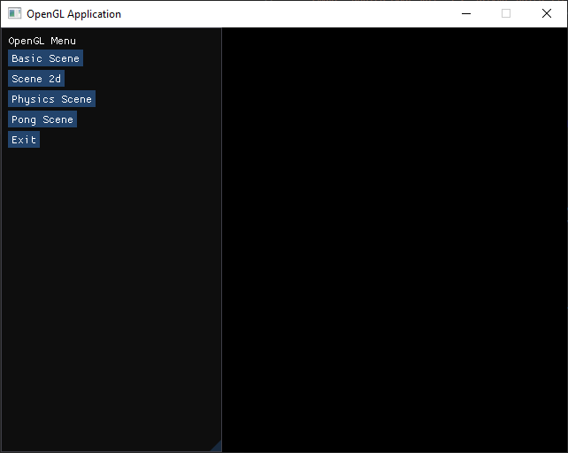
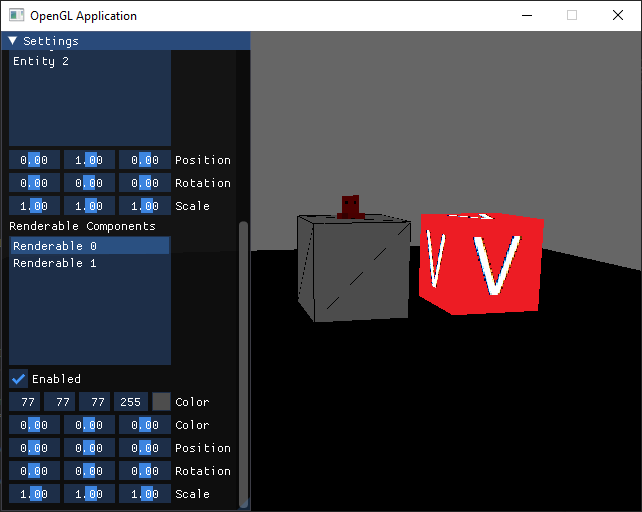
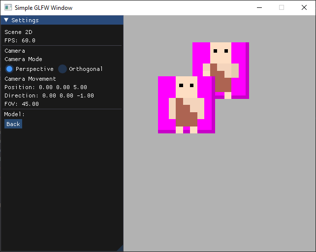
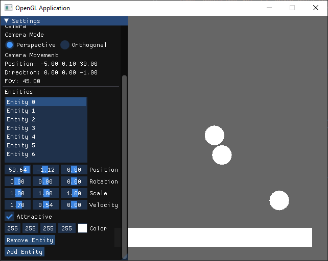

# OpenGL CMake

Opengl and Imgui application for windows built using CMake. Has multiple scenes that can be chosen through the main menu. Camera can be controlled with WASD, space/Shift, rotated with arrow keys and zoomed with "," and "."

Third party files need to be unzipped to run to work around the 100mb file size limit in github.

Windows PowerShell (Only works for x64 due to difficulty getting Assimp to work for x86):

To build (In `\build` directory):
- `cmake -S . -B build`
- `cmake --build .\build\`
- Combined: 
    - `cmake -S . -B build ; cmake --build .\build\ --clean-first`

To run:
- `.\build\Debug\Sandbox.exe`

To clean (Remove everything in `\build`):
- `.\clean-build.bat`

To buld and run (Combined)
- `cmake -DBUILD_MODE=x64 -S . -DCMAKE_BUILD_TYPE=Debug  -B build ; cmake --build .\build\ --clean-first ; .\build\Debug\Sandbox.exe`

## ScreenShots:

### Menu Page

Menu page allows selecting a scene and exiting the page.

### Basic Scene

Basic Scene is pre-set with 2 Entities with renderable components. The Entities and their renderable components can be recolored, moved, rotated and scaled.

### Scene 2d

Scene 2d is testing scene for making a 2d application. It consists of sprites that can be recolored, moved, rotated and scaled.

### Physics Scene

Physics 2d is testing scene for developing and experimenting with physics properties. It consists of 2d entities that can collide with each other.
