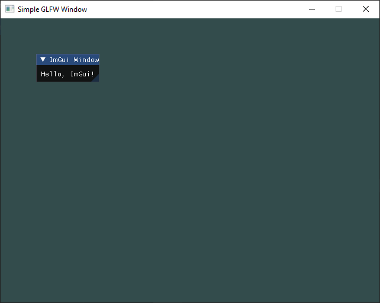

Opengl and Imgui application for windows built using CMake. Camera can be controlled with WASD, rotated with arrow keys and zoomed with "," and "."

Windows PowerShell (Only works for x86 due to difficulty getting SOIL to work for x64):

To build (In /build directory):
- `cmake -S . -B build`
- `cmake --build .\build\`
- Combined: `cmake -S . -B build ; cmake --build .\build\ --clean-first`

To run:
- `.\build\Debug\Sandbox.exe`

To clean (Remove everything in \build):
- `.\clean-build.bat`

TODO
- add SOIL

