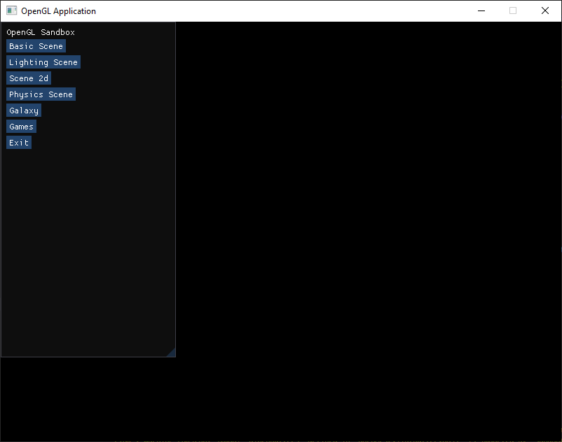
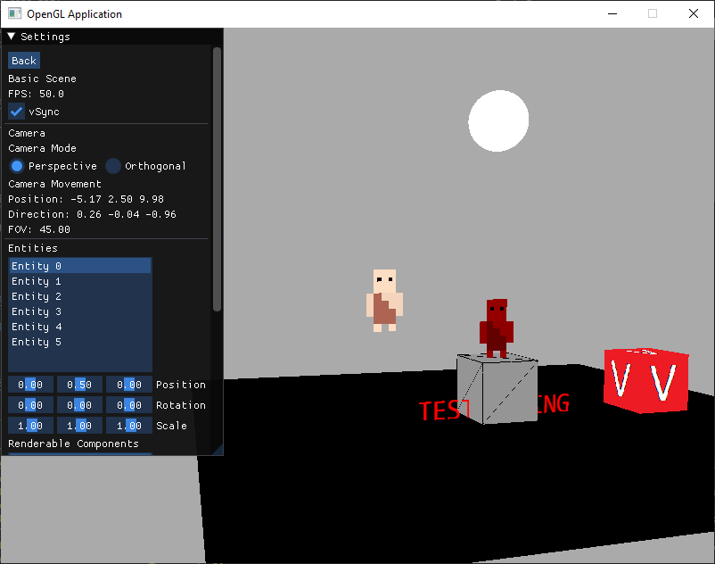
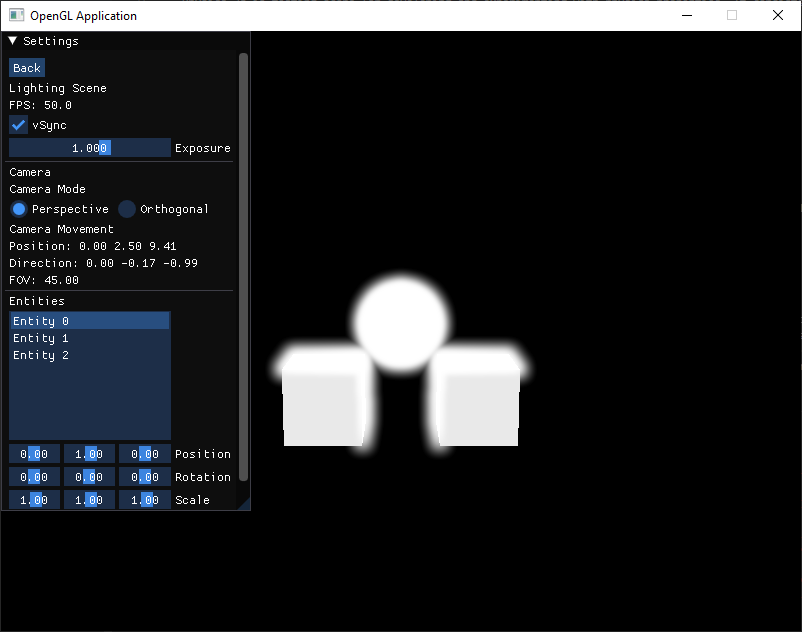
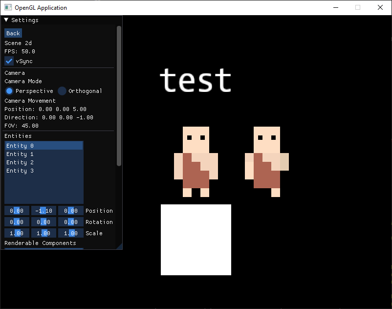
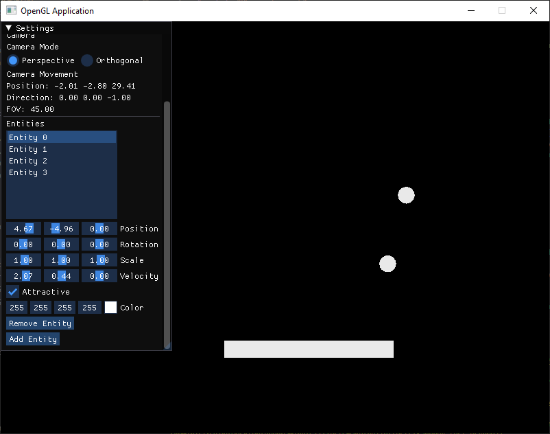
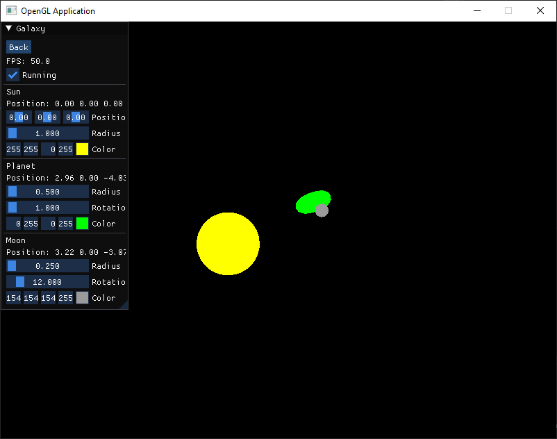
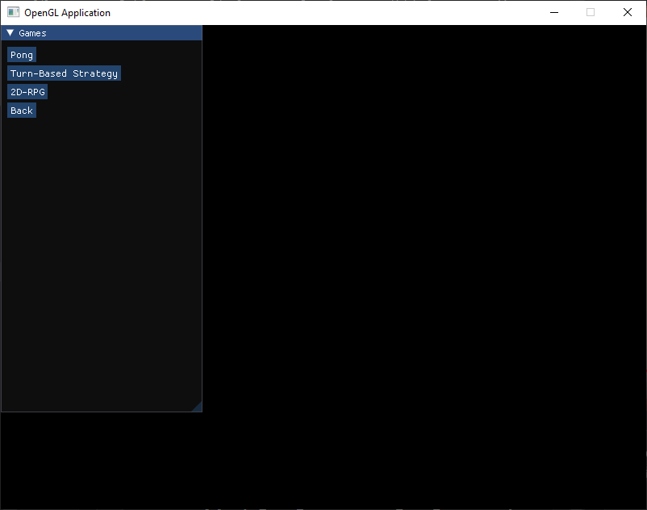
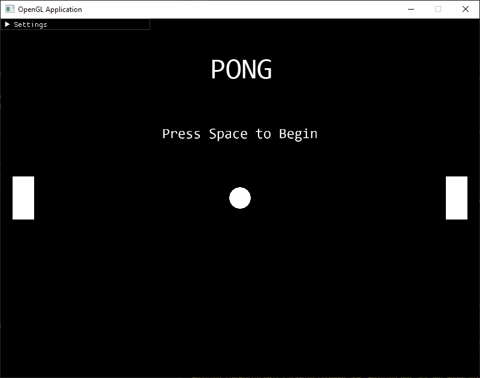
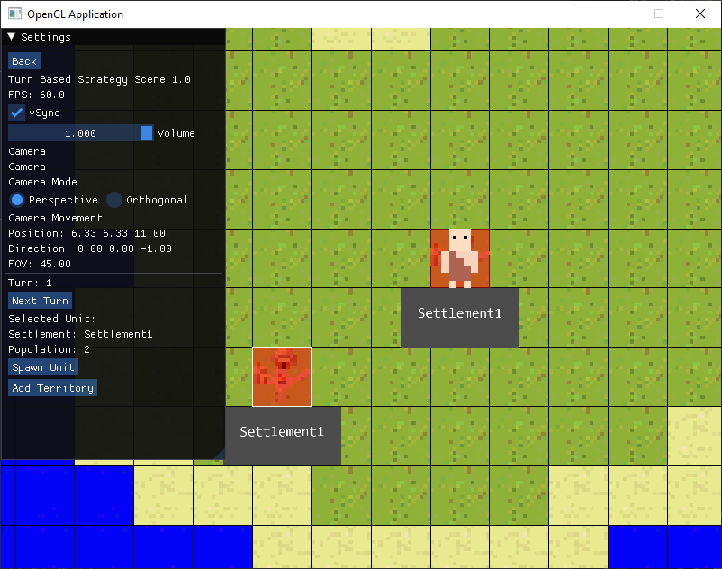

# OpenGL CMake

# ⚠️ This Repository is Deprecated

This repository has been refactored and split into a reusable static library and a Demo application.

1. **[Static Library Repository](https://github.com/VadimEngine/ClayEngine)**: Contains the core functionality as a static library.
2. **[Demo Application Repository](https://github.com/VadimEngine/ClayEngineDemo)**: A demonstration application that uses the static library.
---

Opengl and Imgui application for windows built using CMake. Has multiple scenes that can be chosen through the main menu. Camera can be controlled with WASD, space/Shift, rotated with arrow keys and zoomed with "," and "."

Third party files need to be unzipped to run to work around the 100mb file size limit in github.
### Third Party Libraries
- assimp
    - For loading 3d models
- freetype
    - For loading and rendering fonts and text
- GLEW
    - For managing and using OpenGL extensions
- GLFW
    - For creating windows, receiving input, and managing OpenGL contexts, 
- googletest
    - for unit test
- imgui
    - For prototype GUI
- openAL
    - For playing audio files
- sndfile
    - For loading audio files
- SOIL
    - For loading/saving images such as pngs or bmp

### Instructions 
Windows PowerShell commands (Only works for x64 due to difficulty getting Assimp to work for x86):

- To build (outputs to `\build` directory):
    - `cmake -S . -B build`
    - `cmake --build .\build\`
    - Combined with clean: 
        - `cmake -S . -B build ; cmake --build .\build\ --clean-first`

- To run:
    - `.\build\Debug\Sandbox.exe`

- To clean (Remove everything in `\build`):
    - `.\clean-build.bat`

- To build and run (Combined):
    - `cmake -DBUILD_MODE=x64 -S . -DCMAKE_BUILD_TYPE=Debug  -B build ; cmake --build .\build\ --clean-first ; .\build\Debug\Sandbox.exe`

- To run unit tests
    - `.\build\tests\Debug\Sandbox_test.exe`

## ScreenShots:

### Menu Page

- Menu page allows selecting a scene and exiting the page.

### Basic Scene

- Basic Scene is pre-set with 2 Entities with renderable components. The Entities and their renderable components can be recolored, moved, rotated and scaled.

### Lightning Scene

- A scene to experiment with OpenGL lighting. Supports multiple light sources and objects to reflect the light off

### Scene 2d

- Scene 2d is testing scene for making a 2d application. It consists of sprites that can be recolored, moved, rotated and scaled.

### Physics Scene

- Physics 2d is testing scene for developing and experimenting with physics properties. It consists of 2d entities that can collide with each other.

### Galaxy Scene

- A simple simulation of a planet and moon orbiting a sun.

### Games Scene

- Games Scene is a scene to hold that multiple mini-games that are made using this engine

### Pong Scene

- Pong Scene is a mini game that consists of 2 paddles and a ball. Scoring is tracked when the ball hits the other sides and the game can be replayed.

### Turn Based Strategy Game Scene

- Turn Based Strategy Game Scene is a small game inspired by Sid Meier's Civilization. The camera can be moved with WASD and zoomed in and out with the mouse wheel. Currently the game only has Settlements and Units. Settlements grow each turn and can produce Units if they have enough population and can buy more tiles if they have enough size. Units can move to tiles other than water with each move taking up moves and can also settle to make a new settlement