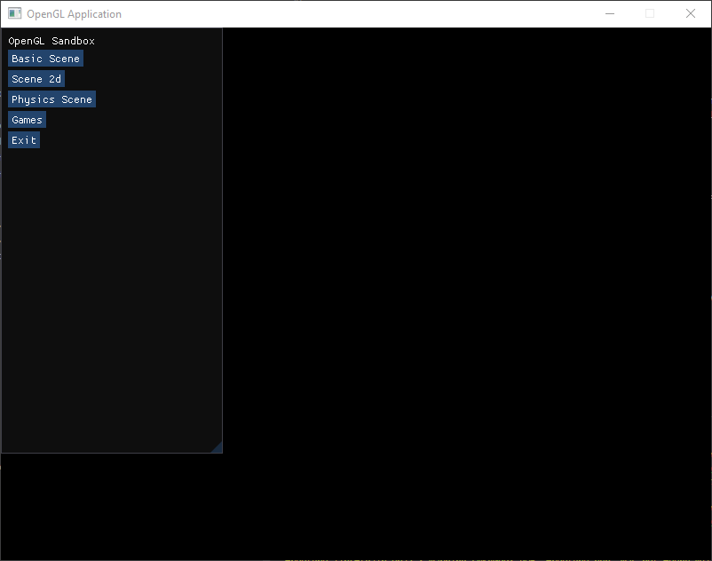
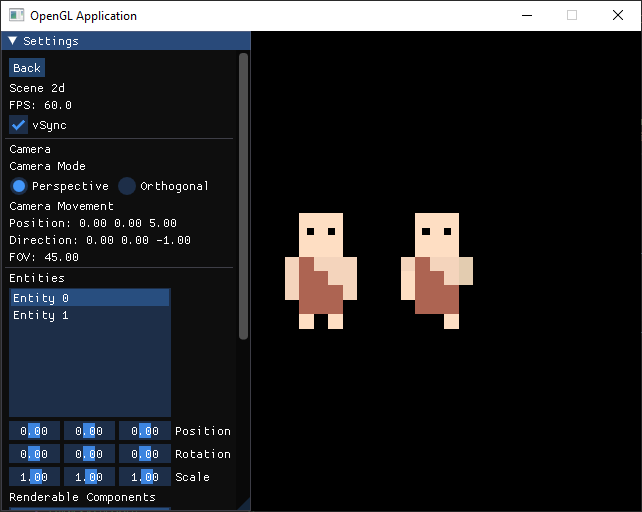

Opengl and Imgui application for windows built using CMake. Has multiple scenes that can be chosen through the main menu. Camera can be controlled with WASD, rotated with arrow keys and zoomed with "," and "."

Third party files need to be unzipped to run to work around the 100mb file size limit in github.

Windows PowerShell (Only works for x64 due to difficulty getting Assimp to work for x86):

To build (In /build directory):
- `cmake -S . -B build`
- `cmake --build .\build\`
- Combined: `cmake -S . -B build ; cmake --build .\build\ --clean-first`

To run:
- `.\build\Debug\Sandbox.exe`

To clean (Remove everything in \build):
- `.\clean-build.bat`

To buld and run (Combined)
- `cmake -DBUILD_MODE=x64 -S . -DCMAKE_BUILD_TYPE=Debug  -B build ; cmake --build .\build\ --clean-first ; .\build\Debug\Sandbox.exe`

ScreenShots:

